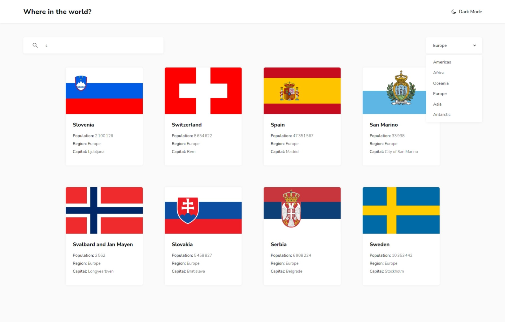

# REST Countries API with color theme switer and search filters

## Table of contents

- [Overview](#overview)
  - [The challenge](#the-challenge)
  - [Screenshot](#screenshot)
  - [Links](#links)
  - [Built with](#built-with)
  - [What I learned](#what-i-learned)
  - [Continued development](#continued-development)
  - [Useful resources](#useful-resources)
- [Author](#author)
- [Acknowledgments](#acknowledgments)

## Overview

### The challenge

Users should be able to:

- See all countries from the API on the homepage
- Search for a country using an `input` field
- Filter countries by region
- Click on a country to see more detailed information on a separate page
- Click through to the border countries on the detail page *(todo)*
- Toggle the color scheme between light and dark mode

### Screenshot



### Links

- Solution URL: [Solution](https://your-solution-url.com)
- Live Site URL: [Github Pages](https://ltossian.github.io/front-country-api/)

### Built with

- Semantic HTML5 markup
- CSS custom properties
- [React](https://reactjs.org/) - JS library
- [Axios](https://www.npmjs.com/package/axios)
- [React Query](https://tanstack.com/query/v3/)
- [TypeScript](https://www.typescriptlang.org/docs/)

### What I learned

I got familiar with React's principles of Reusability, Props, States and Effects.

```ts
   const [regionsList, setRegions] = useState([""]);

    const {isError, isSuccess,isLoading, data} = useQuery(
        ["homeCountries"],
        homeCountriesData,
        {
            staleTime: 60000
        }
    )

    useEffect(() => {
        if (isSuccess) {
            const regionsData: string[] = []
                data.forEach((country) => {
                    if (!regionsData.includes(country.region)) {
                        regionsData.push(country.region)
                    }
                })    
            setRegions(regionsData);
        }
    }, [data, isSuccess])
```

In this snippet, I take advantage of useEffect to set my state when the component mounts && the data is successfully fetched.

### Continued development

I need to deepen my understanding of React with TypeScript, as well as organize my project structures in a better way.
I don't know if my use of props was optimal.

### Useful resources

- [React's Documentation](https://react.dev/learn) - Very clear and useful for basics.
- [Typescript's Documentation](https://www.typescriptlang.org/docs/) - My favorite place to browse these past few days.

## Author

- Frontend Mentor - [@LTOssian](https://www.frontendmentor.io/profile/LTOssian)
- LinkedIn - [@LouisanTchitoula](https://www.linkedin.com/in/louisan-tchitoula/)

## Acknowledgments

Thhanks to [Frontend Mentor](https://www.frontendmentor.io/) for providing quality designs and allow us to focus on the developpement side.
